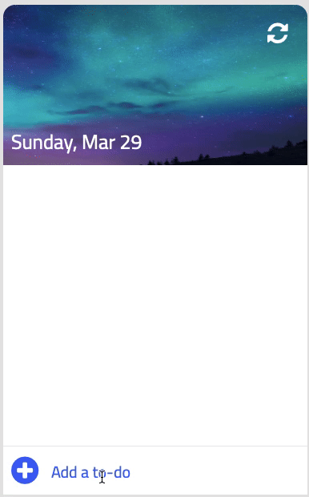

# TODO List using JS

**Functionalities**:

- Add task pressing Enter
- Move the priority
- Check the task when concluding
- Uncheck task
- Remove task
- Refresh TO-DO

**Note**: The TO-DO app shows today's date to the user.

**Tutorial**:https://youtu.be/b8sUhU_eq3g

